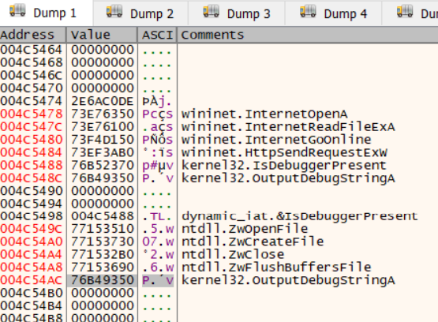
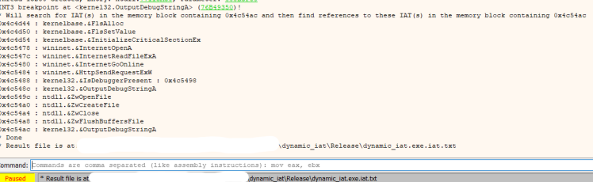
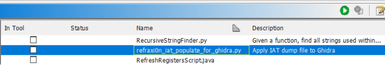

## Refraxi0n : Deobfuscate Runtime/Dynamic IATs using x32dbg and Ghidra

The following code was developed for my UCD FCCI Case Study 2025, called `Deobfuscating Runtime IATs in advanced malware`.

This code is published to aid the malware reversing community in combating advanced malware that might obfuscate their code using Dynamic IAT.


## What?

Deobfuscates the `Dynamic IAT` or `Runtime IAT` technique, which handles two variations:

**Indirect Function Call**:

E.g. from:

```c
void FUN_004b100c(void)
{
  (*DAT_004c54ac)("UseFunctionPointerFromIAT\n");
  return;
}
```

to:

```c
void FUN_004b100c(void)
{
  (*kernel32_OutputDebugStringA)("UseFunctionPointerFromIAT\n");
  return;
}
```


**Double Indirect Function Calls**

E.g. from:

```c
void FUN_004b1019(void)
{
  (*(code *)DAT_004c5498[1])("UseFunctionPointerFromPointerToIAT\n");
  (*(code *)*DAT_004c5498)();
  return;
}
```

to:

```c
void FUN_004b1019(void)
{
  (*(code *)IAT_Resolved__kernel32Ptr_t_004c5498->kernel32_OutputDebugStringA)
            ("UseFunctionPointerFromPointerToIAT\n");
  (*(code *)IAT_Resolved__kernel32Ptr_t_004c5498->kernel32_IsDebuggerPresent)();
  return;
}
```


## How?

By having two distinct plugins: One for x32dbg which dumps the dynamic IAT(s) to a .txt file, and one for Ghidra that reads said .txt file, and populates new structs based on it. The result is indirect - and double indirect - function calls being changed from `undefined` to human readable API function names.


## How well does it perform?

Both the included test sample and in-the-wild malware is deobfuscated quite well, to a point where I haven't observed cases that it couldn't handle.


## Installation

For x32dbg:

* Copy `For_x32dbg\x32\refraxi0n.dp32` to your x32dbg's plugins folder, e.g. `snapshot_2025-07-01_23-29\release\x32\plugins\` (notice that this `plugins` folder might need to be created manually)

* Copy `For_x32dbg\x64\refraxi0n.dp64` to your x32dbg's plugins folder, e.g. `snapshot_2025-07-01_23-29\release\x64\plugins\` (notice that this `plugins` folder might need to be created manually)

For Ghidra:

* Copy `For_Ghidra\refraxi0n_iat_populate_for_ghidra.py` to your Ghidra script folder. E.g. `c:\users\username\ghidra_scripts\` (notice that this folder might need to be created manually)


## Usage

* In x32dbg, find the dynamic/runtime IAT in memory, and keep this memory location selected. E.g.:



* Run the plugin:

`refraxi0n`

* The result is saved in a .txt file (see the log view):



* In Ghidra, to cater for ASLR, make sure to `rebase` the binary according to the loaded base address from x32dbg.

* Run the plugin, and select the .txt file that was produced by the x32dbg plugin.



* The console log will display detailes about each IAT entry, and should be done in a few seconds.

* Your sample should now display the names of the actual API functions, effectively bypassing the Dynamic/runtime IAT obfuscation layer.


## License?

https://unlicense.org/
